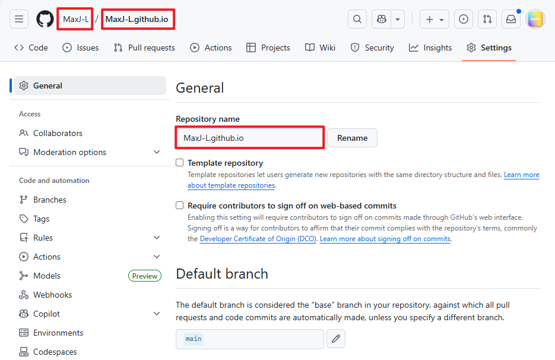
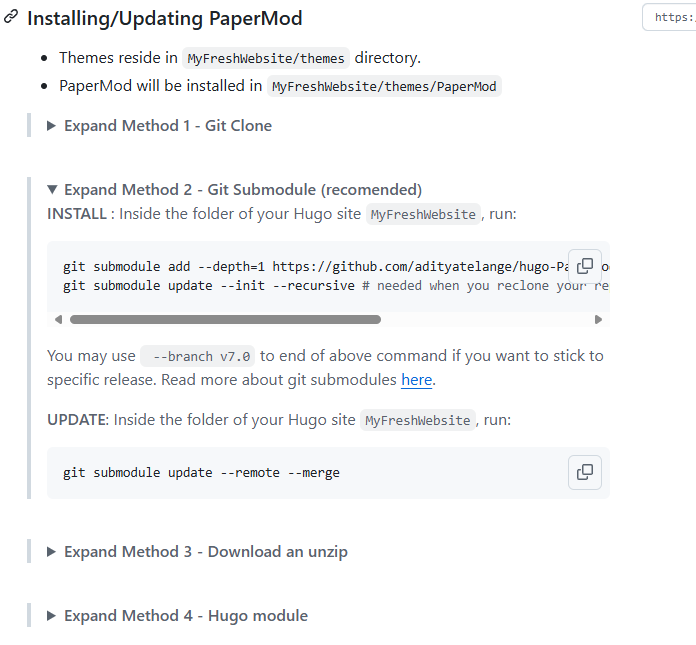
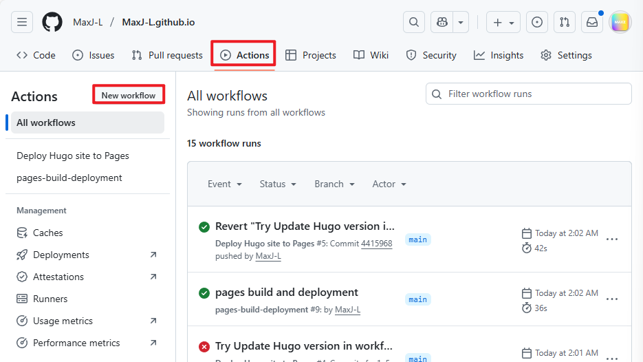
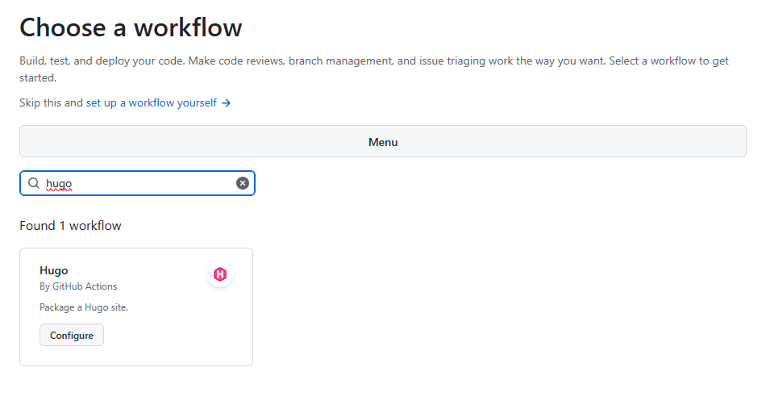
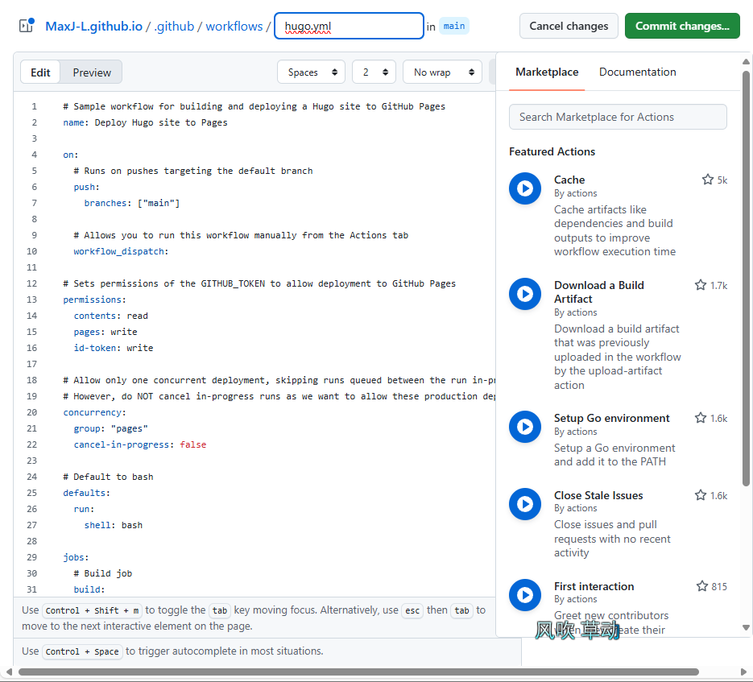

+++
date = '2025-09-21T02:33:41+08:00'
draft = false
title = 'GithubPages搭建个人博客教程'
tags = ['博客搭建']
summary= "Hugo + GitHub Pages 博客搭建全攻略：从入门到自动化部署（含踩坑笔记）"

+++


**技术栈**：`Hugo` + `Git` + `GitHub Pages` + `GitHub Actions`

**主题**：`PaperMod Theme` 


### 初始化Github Pages和Hugo

+ 创建仓库

1. 仓库名字一定要按照`<UserName>.github.io`创建




+ 克隆仓库

```bash
git clone <仓库地址>
git clone https://github.com/MaxJ-L/MaxJ-L.github.io.git
```


+ hugo安装

1. 进入[Releases · gohugoio/hugo](https://github.com/gohugoio/hugo) hugo官方Github网址，通过release下载对应系统的执行文件；
2. 将hugo配置为环境变量；


+ hugo初始化

使用以下命令在当前目录进行初始化

> 一般其实采用hugo new site <BLOG NAME>进行初始化
>
> 但是实际操作发现以下冲突：
>
> 1. git clone会自动创建文件夹；
> 2. hugo new site <BLOG NAME> 会自动创建BLOG NAME的文件夹；
>
> 以上这两个文件夹会冲突（clone不允许同名文件夹、如果不在根目录new site，会导致无法正常现实）
>
> 当然其实这些问题肯定可以通过配置其他文件进行规避的，但是修改和熟悉成本就高很多了

```
hugo new site . --force
```

初始化之后，会出现以下目录

```bash
MaxJ-L.github.io.git
├─archetypes           // 内容模板文件夹。运行 `hugo new` 时，会使用这里的模板来创建新文件
│      default.md      // 内容“模板”，运行 `hugo new` 时会基于此文件创建新文章的结构。
├─assets               // 资源文件夹。存放需要 Hugo 处理的文件，如 SCSS、需要压缩的 JS 等
├─content              // 内容文件夹。你所有的博客文章、页面等 .md 文件都存放在这里，是网站的核心
├─data                 // 数据文件夹。存放 JSON, YAML, TOML 等格式的数据文件，供模板调用。
├─i18n                 // 国际化文件夹。用于存放多语言网站的翻译字符串。
├─layouts              // 布局文件夹。用于存放自定义的 HTML 模板，可以覆盖主题的默认布局。
├─public               // 输出文件夹。运行 `hugo` 命令后，生成的完整静态网站会放在这里。这是最终部署的“成品”。
├─static               // 静态文件夹。存放无需处理的文件，如图片、CSS、字体等。会原样复制到最终网站。
└─themes               // 主题文件夹。存放你下载的网站主题，比如 PaperMod。
hugo.toml              // 网站的“大脑”，最重要的全局配置文件，包含网址、主题、菜单等所有设置。
```


### 主题安装与核心配置

#### 主题安装

> [Hugo Themes](https://themes.gohugo.io/)网站上面有许多主题，可以自行跳转主题进行下载；
>
> 我选择的是PaperMod，进入对应的Github地址[adityatelange/hugo-PaperMod: A fast, clean, responsive Hugo theme.](https://github.com/adityatelange/hugo-PaperMod)

1. 根据[Installation · adityatelange/hugo-PaperMod Wiki](https://github.com/adityatelange/hugo-PaperMod/wiki/Installation)上面对应的安装方法；



2. 我使用推荐的方法2进行安装

```bash
git submodule add --depth=1 https://github.com/adityatelange/hugo-PaperMod.git themes/PaperMod
git submodule update --init --recursive # needed when you reclone your repo (submodules may not get cloned automatically)
```

```bash
git submodule update --remote --merge
```


#### 核心配置

1. hugo.toml

```yaml
baseURL = "https://MaxJ-L.github.io/"  ## 这里是你的仓库Github Pages地址
languageCode = 'zh-CN'   ## 这里配置成对应的语言
theme = 'PaperMod'   ## 这里配置成你选中的主题，我这里选择了PaperMod
title = 'The MaxJ-L Stack'  ## 这里是BLOG的标题

[outputs]
  home = ["HTML", "RSS", "JSON"]

  # -- 导航栏菜单配置 --
  # 导航栏需要显式配置归档、搜索和标签，才可以显示。如果不配置，打开之后只显示主页
[[menu.main]]
  identifier = "archives"
  name = "归档"
  url = "/archives/" # 链接到我们刚刚创建的 archives.md
  weight = 10 # 权重，数字越小越靠前

[[menu.main]]
  identifier = "search"
  name = "搜索"
  url = "/search/"
  weight = 20

[[menu.main]]
  identifier = "tags"
  name = "标签"
  url = "/tags/"
  weight = 30

```

2. 在content下面创建`archives.md`和`search.md`，然后补充内容

```markdown
---
title: "Archives"
layout: "archives"
# archives.md`
# 不要改动这个文件的其他内容
---
```

```markdown
---
title: "Search"
layout: "search"
# search.md
# 不要改动这个文件的其他内容
---
```


#### Hugo 本地调试

```bash
hugo server
```

如果显示如下，则说明没有错误，打开http://localhost:1313/即可；

如果有语法错误，会有提示；

```
                  │ EN 
─────────┼──
 Pages            │ 13
 Paginator pages  │  0
 Non-page files   │  0
 Static files     │  0
 Processed images │  0
 Aliases          │  2
 Cleaned          │  0

Built in 230 ms
Environment: "development"
Serving pages from disk
Running in Fast Render Mode. For full rebuilds on change: hugo server --disableFastRender
Web Server is available at http://localhost:1313/ (bind address 127.0.0.1)
Press Ctrl+C to stop
```


### PUSH到远程仓库并且实现CI/CD自动化部署

> 目的是实现PUSH的时候自动触发deploy部署

#### push到远程仓库

```bash
git add .
git commit -m "First Add"
git push origin main
```


#### Github Actions自动化部署

##### 方案1 手动创建文件

1. 根目录手动创建文件`.github/workflows/hugo.yml`
2. 填充以下内容

```yaml
# Sample workflow for building and deploying a Hugo site to GitHub Pages
name: Deploy Hugo site to Pages

on:
  # Runs on pushes targeting the default branch
  push:
    branches: ["main"]

  # Allows you to run this workflow manually from the Actions tab
  workflow_dispatch:

# Sets permissions of the GITHUB_TOKEN to allow deployment to GitHub Pages
permissions:
  contents: read
  pages: write
  id-token: write

# Allow only one concurrent deployment, skipping runs queued between the run in-progress and latest queued.
# However, do NOT cancel in-progress runs as we want to allow these production deployments to complete.
concurrency:
  group: "pages"
  cancel-in-progress: false

# Default to bash
defaults:
  run:
    shell: bash

jobs:
  # Build job
  build:
    runs-on: ubuntu-latest
    env:
      HUGO_VERSION: 0.150.0
    steps:
      - name: Install Hugo CLI
        run: |
          wget -O ${{ runner.temp }}/hugo.deb https://github.com/gohugoio/hugo/releases/download/v${HUGO_VERSION}/hugo_extended_${HUGO_VERSION}_linux-amd64.deb \
          && sudo dpkg -i ${{ runner.temp }}/hugo.deb
      - name: Install Dart Sass
        run: sudo snap install dart-sass
      - name: Checkout
        uses: actions/checkout@v4
        with:
          submodules: recursive
      - name: Setup Pages
        id: pages
        uses: actions/configure-pages@v5
      - name: Install Node.js dependencies
        run: "[[ -f package-lock.json || -f npm-shrinkwrap.json ]] && npm ci || true"
      - name: Build with Hugo
        env:
          HUGO_CACHEDIR: ${{ runner.temp }}/hugo_cache
          HUGO_ENVIRONMENT: production
        run: |
          hugo \
            --minify \
            --baseURL "${{ steps.pages.outputs.base_url }}/"
      - name: Upload artifact
        uses: actions/upload-pages-artifact@v3
        with:
          path: ./public

  # Deployment job
  deploy:
    environment:
      name: github-pages
      url: ${{ steps.deployment.outputs.page_url }}
    runs-on: ubuntu-latest
    needs: build
    steps:
      - name: Deploy to GitHub Pages
        id: deployment
        uses: actions/deploy-pages@v4

```


##### 方案2 页面配置

1. 进入仓库页面，依次点击`Actions`、`New workflow`进入选择workflow页面；




2. workflow页面搜索hugo，点击`Configure`；



3. 显示以下页面，修改内容，然后点击`Commit changes...`



> 这里有个坑：ParperMod对hugo版本号有要求
>
> hugo v0.146.0 or greater is required for hugo-PaperMod to build
>
> 因此模板那里需要修改一下版本号


### 感谢

[如何用 GitHub Pages + Hugo 搭建个人博客 · KrislinBlog](https://krislinzhao.github.io/docs/create-a-wesite-using-github-pages-and-hugo/#4-使用-hugo-创建网站)


