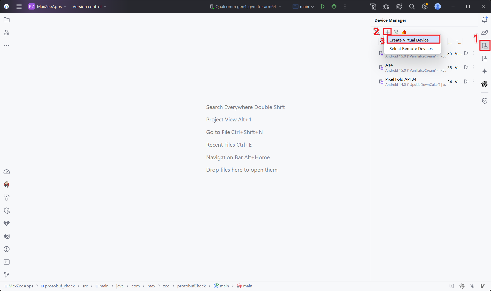
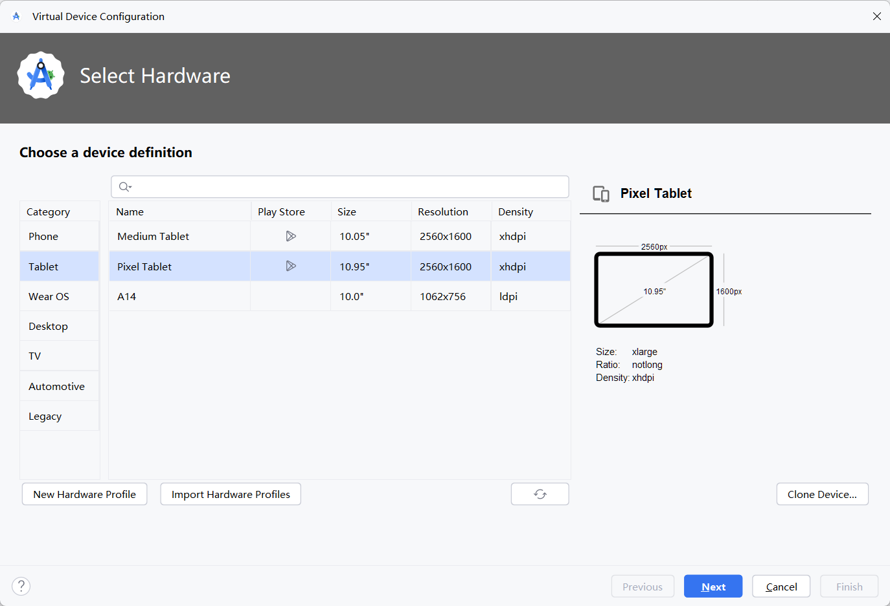
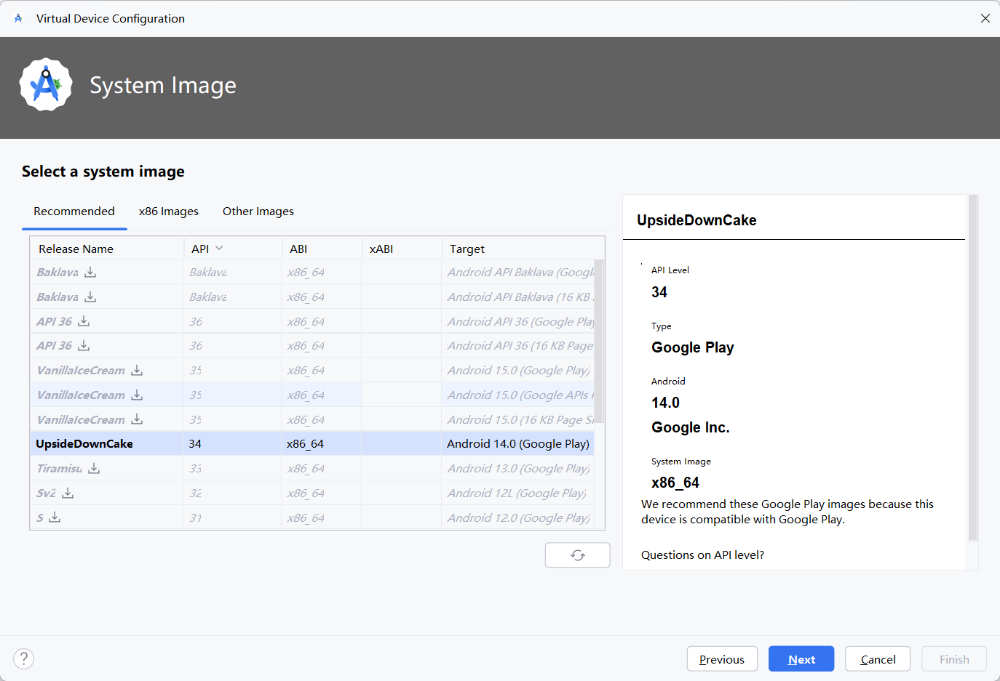
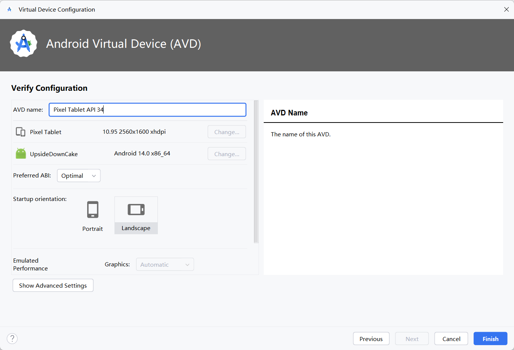
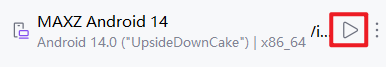
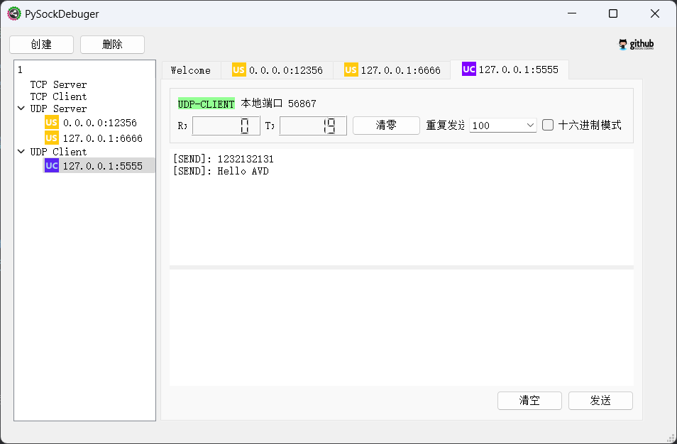
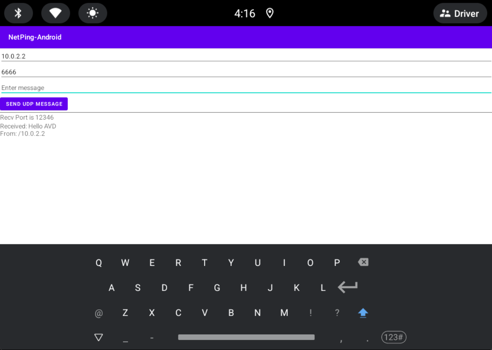

+++
date = '2025-10-01T00:00:00+08:00'
draft = false
title = '自定义AVD镜像搭建和AVD与主机UDP通信'
tags = ['AOSP', 'AVD']
summary= "使用自编译的AVD镜像，并验证与主机的UDP通信"
+++


# 前置条件
1. 安装Android Studio；
	+ 参考1： [安装 Android Studio](https://developer.android.com/studio/install?hl=zh-cn)
	+ [Android Studio 安装配置教程- Windows(详细版)-CSDN博客](https://blog.csdn.net/qq_38436214/article/details/105073213)
2. adb环境变量
	+ 安装好AS之后，一般就会有adb了，通常安装在 Android SDK 目录下的 platform-tools 子文件夹，找出这个命令，并设置环境变量；
3. Java环境
	+ 网络上一堆教程，自行设置；


# AVD创建
1. 打开AS，按顺序点击图标；


2. 选择设备定义，因为我们是做车载的，因此最好选一个平板设备，设备列表上有尺寸、分辨率和像素密度；


3. 选择镜像，我们现在是Android 14， 对应API 34， 选择API 34的镜像；
+ 如果这里没有下载过API 34的镜像，会出现下图中其他API一样的下载图标，下载即可；


4. 设置设备名及相关参数，设备名自己改一下适合的，参数大致看一下，选择自己合适的即可；


5. 点击Finish之后，AVD便创建完成了，点击运行按钮，即可打开；


# 编译自定义镜像
1. 正常从AOSP获取代码即可，我这里编译的是Android 14的镜像，采用的是**android14-release**分支；
```bash
repo init --partial-clone -b android14-release -u [https://android.googlesource.com/platform/manifest](https://android.googlesource.com/platform/manifest)
repo sync -c -j8
```

2. 编译：
	+ lunch 选项中， 选择SDK开头的COMBO， 这些COMBO才可以当作虚拟设备进行使用；
	+ 后面的架构具体看使用镜像的设备的架构，如Windows使用，一般选择x86_64；
	+ 其他的一些概念，md指multi display多屏，car\pc\phone等是指产品、portrait是默认竖屏模式等等；
```
source build/envsetup.sh
lunch 
73. sdk_car_arm-userdebug
74. sdk_car_arm64-userdebug
75. sdk_car_md_x86_64-userdebug
76. sdk_car_portrait_x86_64-userdebug
77. sdk_car_x86-userdebug
78. sdk_car_x86_64-userdebug
79. sdk_pc_x86_64-userdebug
```

3. 编译完成后，用以下命令进行打包，会生成对应的镜像文件，这个就是我们需要的虚拟设备的镜像文件；
```
make emu_img_zip // Android13及以上
// 会生成sdk-repo-linux-system-images-eng.[username]].zip文件

make -j32 sdk sdk_repo // Android13以下
// 会在out/host/linux-x86/sdk/sdk_phone_x86生成
// sdk-repo-linux-system-images-eng.[username].zip
// repo-sys-img.xml
```

3. 直接在AOSP环境使用，直接运行
+ 如果重新进入环境，需要提前source build/envsetup.sh和lunch <之前对应的COMBO>
```
emulator
// 如果要使用root remount获取权限
emulator -writable-system
```
# 使用自定义的镜像
## 问题
从Android Studio运行的镜像，会有以下几个问题：
1. 比自行打开emulator会稍微卡顿一些；
2. AS默认没有加emulator -writable-system选项，没办法获得system用户权限；
3. AS里面都是一些预置的镜像，没有入口运行自己编译的镜像；

## 步骤
> 这里是基于Android 14的镜像进行替换，上文提到Android13以下的编译方式有所不同，不知道此方案是否一样可行
1. 上述我们已经拿到了所需要的自定义的镜像文件，那么就可以使用镜像文件，替代Android Studio的镜像来运行了；

2. 解压自定义镜像
解压sdk-repo-linux-system-images-eng.[username]].zip，结构树如下
```
sdk-repo-linux-system-images-eng
└─x86_64
    └─data
        ├─media
        │  └─0
        │      └─test
        │          └─CtsMediaTestCases-1.4
        └─misc
            ├─apns
            ├─emulator
            │  └─config
            ├─gceconfigs
            └─modem_simulator
                └─etc
                    └─modem_simulator
                        └─files
```

3. 替换镜像
这里假设之前已经创建好了一个AVD，需要将sdk-repo-linux-system-images-eng中的x86_64，替换原本下载的API 34的镜像；
3.1 找出android sdk的位置，我这里位置是`C:\Users\<user>\AppData\Local\Android\Sdk\`
3.2 将SDK文件夹下**system-images\android-34\google_apis\x86_64**删除，然后替换成sdk-repo-linux-system-images-eng中的x86_64；
3.3 将SDK下的emulator文件夹，设置为环境变量；

4. 使用以下命令打开虚拟设备：
```
// 如果emulator是环境变量，直接使用emulator命令即可；
C:\Users\<user>\AppData\Local\Android\Sdk\emulator\emulator.exe -avd <之前创建的AVD设备名> -sysdir C:\Users\<user>\AppData\Local\Android\Sdk\system-images\android-34\google_apis\x86_64 -writable-system

说明：
emulator命令
-avd <之前的虚拟设备名>
-sysdir <替换后的x86_64文件夹地址>
-writable-system 允许用户进行root、remount，以便修改设备

```

5. BINGO

# 验证AVD镜像与本地Windows的UDP通信

参考：
+ [设置 Android 模拟器网络 | Android Studio](https://developer.android.com/studio/run/emulator-networking?hl=zh-cn)

##  UDP
### Android --> PC(Windows)

1. 测试程序-发送端
> 对外必须发到10.0.2.2，具体参考官网文章。10.0.2.2是对于AVD的PC的本地环回IP

2. PC端 UDP 监听对应端口即可；

### PC(Windows) --> Android

1. 从PC端命令行是无法直接看到AVD的IP、端口等信息的，需要按照参考文章，进行端口映射；

2. 端口映射
2.1 访问控制台
```
adb devices
List of devices attached
emulator-5554   device  // 这里的5554，就是AVD模拟器实例的控制台的端口；


telnet localhost 5554  // 通过 telnet 命令访问控制台
```

2.2 进入控制台后，第一步是需要先认证，否则能看到的命令就只有如下几个，没有redir命令

```
Android Console: Authentication required
Android Console: type 'auth <auth_token>' to authenticate
Android Console: you can find your <auth_token> in
'C:\Users\<user>\.emulator_console_auth_token'
OK

help
Android console commands:
help|h|?
help-verbose
ping
avd
auth
quit|exit
Try 'help-verbose' for more description
Try 'help <command>' for command-specific help
OK 
```

2.3 控制台认证，认证的方式就是如提示所示，查看`C:\Users\<user>\.emulator_console_auth_token`文件的token，然后用auth命令进行认证；
认证之后，才可以进行更高权限的操作
```
auth FQn7ZW+ePZmQZ4hJ
Android Console: type 'help' for a list of commands
OK    
```

2.4 端口映射
redir add <协议类型> PC端口：AVD端口
```
redir add tcp:5000:6000   // 这个的意思是将PC端的5000端口，映射到AVD的6000端口，仅限TCP协议
redir add udp:5000:6000   // 这个的意思是将PC端的5000端口，映射到AVD的6000端口，仅限UDP协议
```

3. 接下来PC只需要发到本地的对应的PC端口，然后AVD中apk监听映射后的端口即可

### 测试工具
1. 测试工具是一个桌面端工具和一个APK
2. 测试工具：https://github.com/uname/PySockDebuger/releases/tag/1.0Beta
	可以用于桌面端模拟UDP发送和接收
	
	
3. APK
3.1 安装
```
adb install -t <apk路径>
// 出现Success字样即说明安装成功
```

3.2 通过AVD点击图标打开
默认接收端口为12346，不可更改（验证接收前，请按照[[自定义AVD镜像搭建和UDP通信验证#PC(Windows) --> Android]]进行端口转发）
可以自行输入发送端口和消息进行发送，发送IP必须是10.0.2.2



## 附笔记：
1. 测试程序-发送端
```java
new Thread(new UdpSendRunnable()).start();

private class UdpSendRunnable implements Runnable {  
	@Override  
	public void run() {  
		while (true) {  
			try (DatagramSocket socket = new DatagramSocket()) 
			{  
				byte[] data = "Hello".getBytes();  
				Log.i("MAXZ", "run: Hello");  
				DatagramPacket packet = new DatagramPacket(data, data.length, InetAddress.getByName("10.0.2.2"), 12346);  
				socket.send(packet); // 直接发送  
				sleep(1000);  
			} catch (IOException | InterruptedException e) {  
				Log.i("MAXZ", "run: " + e);  
				throw new RuntimeException(e);  
			}  
		}  
	}  
}
```

2. 测试程序-接收端
```java
public static void main(String[] args) throws IOException {  
    DatagramSocket socket = null;  
    try {  
        socket = new DatagramSocket(12346);  
    } catch (SocketException e) {  
        throw new RuntimeException(e);  
    }  
    byte[] buffer = new byte[1024];  
    while (true) {  
  
        DatagramPacket packet = new DatagramPacket(buffer, buffer.length);  
        socket.receive(packet); // 阻塞等待数据  
  
        String message = new String(packet.getData(), 0, packet.getLength());  
        String displayText = "Received: " + message + "\nFrom: " + packet.getAddress();  
  
        System.out.println(displayText);  
    }  
}
```

